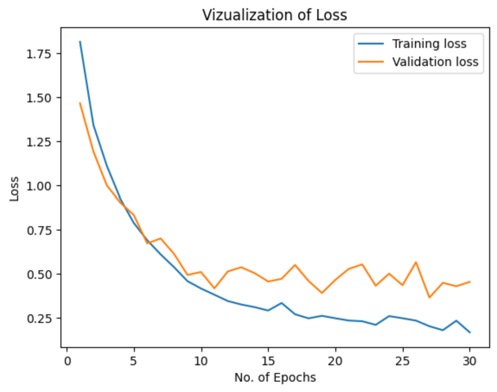
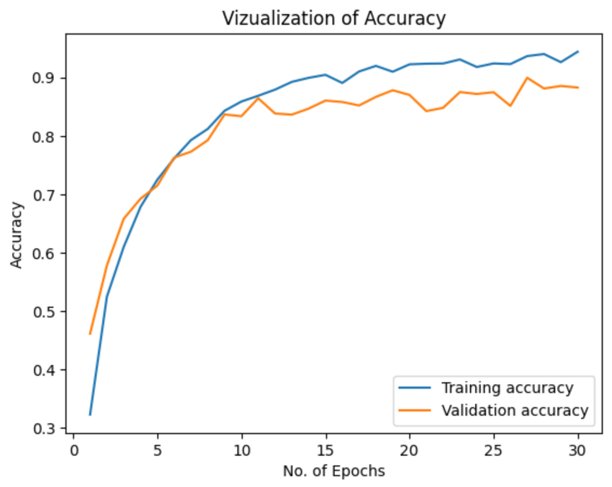
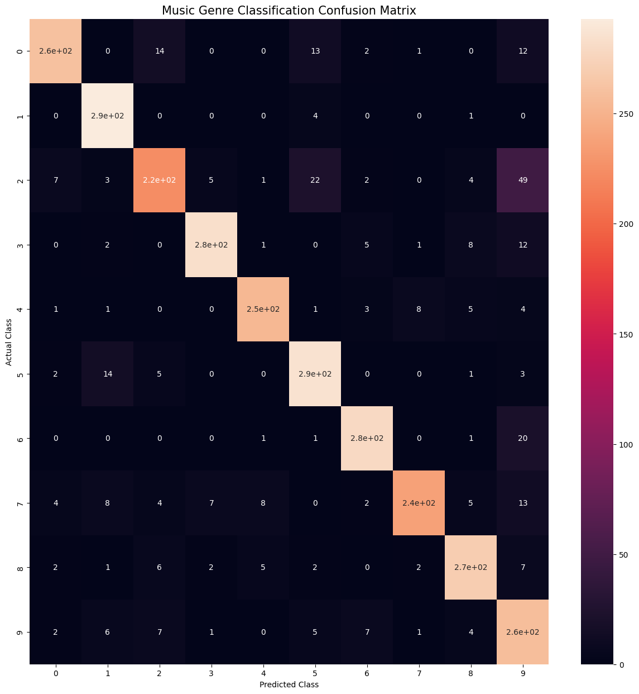

## Description

 - Developed a machine learning project focused on music genre classification using audio data, employing libraries such as TensorFlow and Librosa for audio processing and model training.
 - Implemented data preprocessing techniques, including feature extraction from audio files, to enhance model performance and accuracy in genre classification tasks.
 - Designed and trained a convolutional neural network (CNN) architecture, achieving significant accuracy in classifying various music genres based on audio features.
 - Utilized data visualization tools to analyze model performance and interpret results, facilitating a deeper understanding of the classification process and feature importance.
 - Conducted thorough testing and validation of the model, leading to the successful deployment of an application capable of real-time music genre identification.

## Model Evaluation

### Vizualization of Loss 

&nbsp;
&nbsp;
&nbsp;
&nbsp;
&nbsp;
&nbsp;
&nbsp;
&nbsp;
&nbsp;
&nbsp;
### Vizualization of Accuracy

&nbsp;
&nbsp;
&nbsp;
&nbsp;
&nbsp;
&nbsp;
&nbsp;
&nbsp;
&nbsp;
&nbsp;
### Confusion Matrix 
