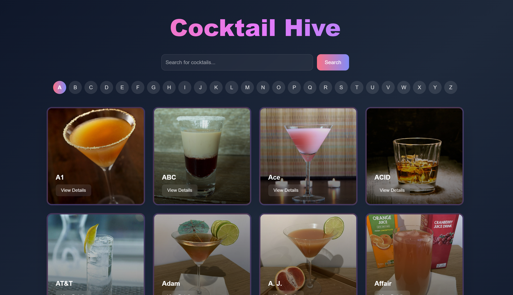

- **Built with Next.js**, ensuring a highly responsive and dynamic user experience.  
- **Alphabet-based filtering**, allowing users to browse cocktails by selecting a letter.  
- **Search bar for finding cocktails by name**, making discovery effortless.  
- **Pagination for smooth navigation**, making it easy to explore an extensive cocktail database.  
- **Dynamic API fetching and caching** for faster performance and reduced loading times.  
- **Modern and responsive UI/UX** designed with Tailwind CSS for a visually appealing experience.  
- **Optimized for mobile and desktop**, ensuring seamless usability across devices.  

## Tech Stack Used

-  Next JS
-  CocktailDb API
-  JavaScript
-  Tailwind CSS
-  Vercel
-  Git